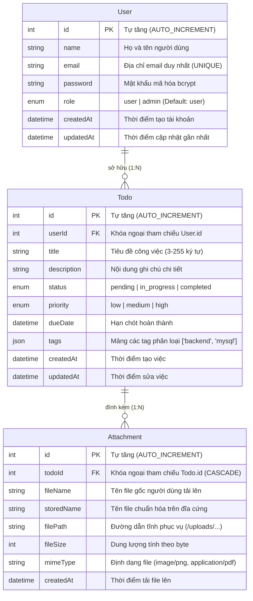
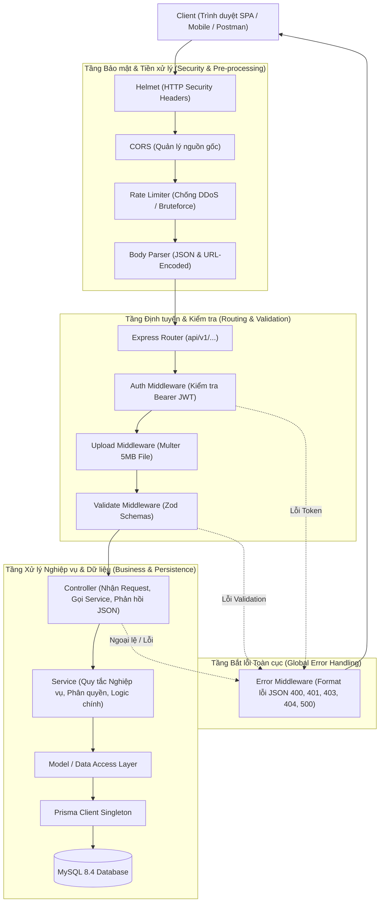
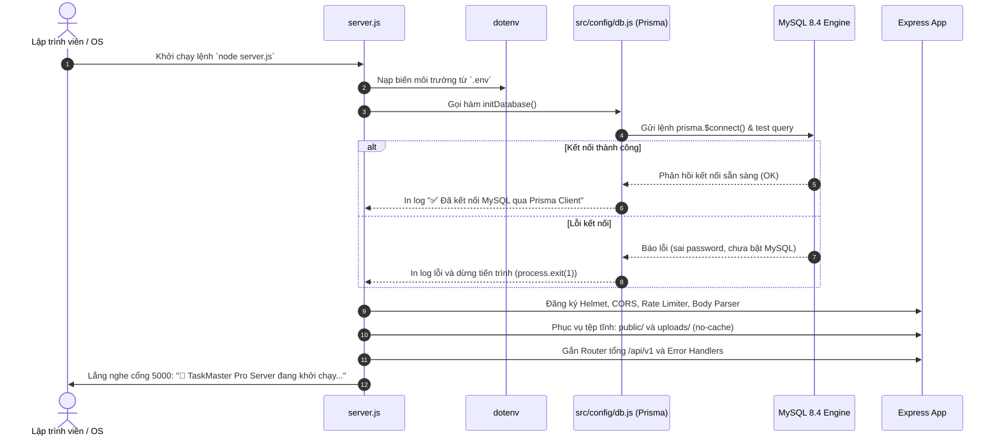
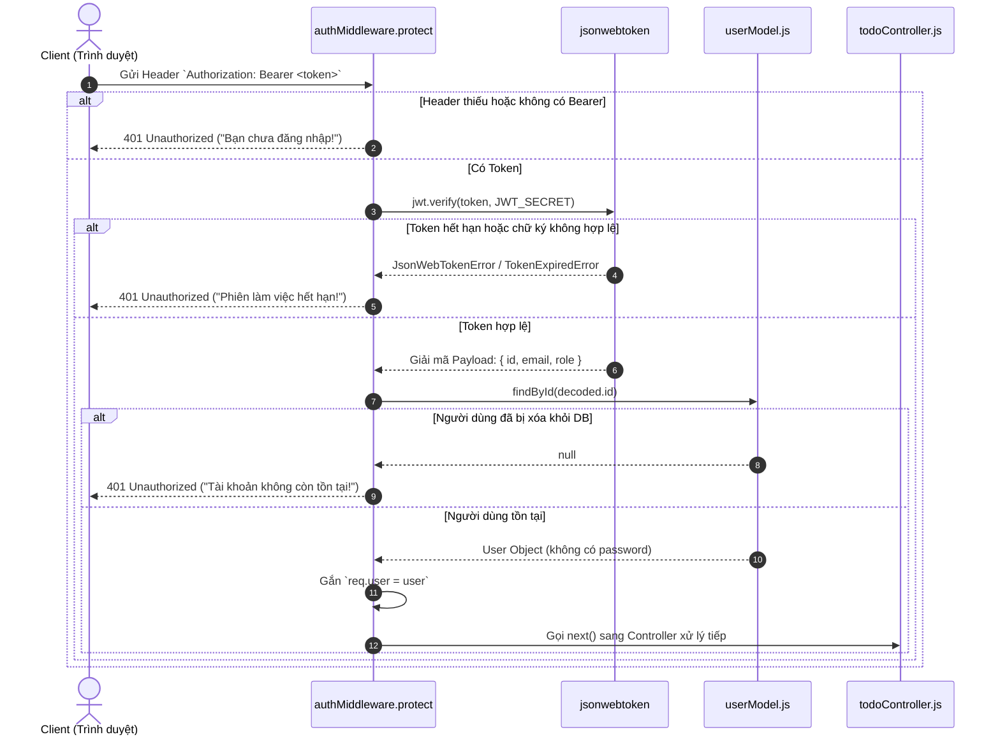
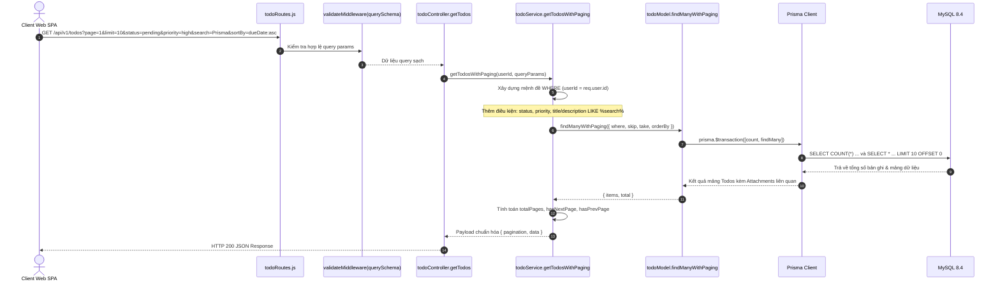
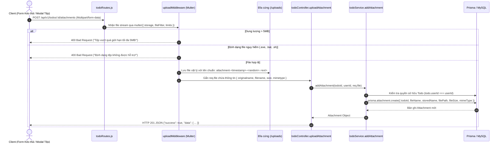

# 📘 TÀI LIỆU KIẾN TRÚC HỆ THỐNG, CẤU TRÚC FILE & LUỒNG HOẠT ĐỘNG
## DỰ ÁN: TASKMASTER PRO (CẤP ĐỘ 3: PRODUCTION-READY)

> **Ngày cập nhật:** 16/09/2026  
> **Phiên bản hệ thống:** v3.0 (Prisma ORM + MySQL 8.4 + Zod + Multer + SaaS Light Theme)  
> **Kiến trúc:** Phân tầng chuẩn công nghiệp (Layered Architecture: Route - Controller - Service - Model/ORM)

---

## MỤC LỤC
1. [Tổng quan Công nghệ (Technology Stack)](#1-tổng-quan-công-nghệ-technology-stack)
2. [Cấu trúc Thư mục Dự án (Project Directory Structure)](#2-cấu-trúc-thư-mục-dự-án-project-directory-structure)
3. [Mô hình Dữ liệu Quan hệ (ERD - Database Schema)](#3-mô-hình-dữ-liệu-quan-hệ-erd---database-schema)
4. [Kiến trúc Phân tầng Hệ thống (Layered Architecture)](#4-kiến-trúc-phân-tầng-hệ-thống-layered-architecture)
5. [Các Luồng Hoạt Động Chi Tiết (Detailed System Workflows)](#5-các-luồng-hoạt-động-chi-tiết-detailed-system-workflows)
   - [5.1. Luồng Khởi động Ứng dụng & Kết nối Database](#51-luồng-khởi-động-ứng-dụng--kết-nối-database)
   - [5.2. Luồng Xác thực Người dùng (Authentication Flow)](#52-luồng-xác-thực-người-dùng-authentication-flow)
   - [5.3. Luồng Quản lý Công việc (Todo CRUD + Filter + Sort + Pagination)](#53-luồng-quản-lý-công-việc-todo-crud--filter--sort--pagination)
   - [5.4. Luồng Tải lên & Quản lý Tệp đính kèm (Multer File Upload Flow)](#54-luồng-tải-lên--quản-lý-tệp-đính-kèm-multer-file-upload-flow)
   - [5.5. Luồng Kiểm tra Dữ liệu & Bắt Lỗi Toàn cục (Validation & Error Handling)](#55-luồng-kiểm-tra-dữ-liệu--bắt-lỗi-toàn-cục-validation--error-handling)
   - [5.6. Luồng Tương tác Giao diện Frontend SPA (Client-Side Lifecycle)](#56-luồng-tương-tác-giao-diện-frontend-spa-client-side-lifecycle)
6. [Danh mục Chi tiết Toàn bộ API Endpoints](#6-danh-mục-chi-tiết-toàn-bộ-api-endpoints)
7. [Hướng dẫn Cài đặt & Vận hành Hệ thống](#7-hướng-dẫn-cài-đặt--vận-hành-hệ-thống)

---

## 1. TỔNG QUAN CÔNG NGHỆ (TECHNOLOGY STACK)

| Nhóm chức năng | Công nghệ / Thư viện | Phiên bản | Vai trò & Lý do lựa chọn |
| :--- | :--- | :--- | :--- |
| **Runtime Environment** | Node.js | v22+ | Môi trường thực thi JavaScript phía máy chủ, hiệu năng cao, non-blocking I/O, hỗ trợ chuẩn ES Modules native (`import/export`). |
| **Web Framework** | Express.js | ^4.21.2 | Framework định tuyến HTTP gọn nhẹ, linh hoạt, hỗ trợ hệ thống middleware mạnh mẽ để xử lý bảo mật, xác thực, validation. |
| **Database Engine** | MySQL | 8.4 LTS | Hệ quản trị cơ sở dữ liệu quan hệ (RDBMS) chuẩn doanh nghiệp, hỗ trợ ACID Transactions, Foreign Keys Cascade, lập chỉ mục tốc độ cao. |
| **ORM & Migration** | Prisma ORM | ^6.19.3 | Công cụ quản lý schema khai báo tập trung, type-safe query builder chống SQL Injection 100%, tự động sinh lịch sử migration chuyên nghiệp (`prisma migrate`). |
| **Request Validation** | Zod | ^4.6.5 | Schema declaration and validation library. Bắt lỗi dữ liệu đầu vào ngay tại tầng middleware trước khi dữ liệu đi vào logic nghiệp vụ. |
| **File Uploading** | Multer | ^2.4.0 | Xử lý `multipart/form-data`. Giới hạn dung lượng an toàn tối đa 5MB, lọc MIME type (ảnh, pdf, docx, zip) và lưu trữ vật lý trên đĩa. |
| **Authentication** | JSON Web Token (JWT) | ^9.0.3 | Cơ chế xác thực phi trạng thái (stateless auth) thông qua header `Authorization: Bearer <token>`. |
| **Password Hashing** | bcryptjs | ^3.0.3 | Mã hóa mật khẩu người dùng với muối ngẫu nhiên (salt rounds = 10), đảm bảo an toàn tuyệt đối ngay cả khi dữ liệu bị lộ. |
| **Security Headers** | Helmet | ^8.3.0 | Tự động thiết lập 15+ HTTP security headers, chống Clickjacking, XSS, MIME sniffing, quản lý Content Security Policy (CSP). |
| **CORS** | CORS | ^2.8.6 | Quản lý chia sẻ tài nguyên giữa các domain khác nhau một cách an toàn. |
| **Rate Limiting** | express-rate-limit | ^8.7.0 | Giới hạn tần suất request (500 req/15 phút toàn cục, 30 req/15 phút cho Auth) chống tấn công từ chối dịch vụ (DDoS) và Brute Force. |
| **Request Logger** | Morgan | ^1.12.1 | Ghi nhật ký HTTP requests phục vụ debug và giám sát trong môi trường phát triển. |
| **Frontend Web** | Vanilla HTML5, CSS3, JS | ES6+ | SPA (Single Page Application) thuần không phụ thuộc framework cồng kềnh, tối ưu tốc độ tải trang dưới 50ms, phong cách **Modern SaaS Light Theme**. |

---

## 2. CẤU TRÚC THƯ MỤC DỰ ÁN (PROJECT DIRECTORY STRUCTURE)

```
Express/
├── .env                                # Biến môi trường bảo mật (DATABASE_URL, JWT_SECRET, PORT...)
├── .env.example                        # Mẫu biến môi trường cho lập trình viên mới
├── .gitignore                          # Cấu hình bỏ qua node_modules, uploads, file log
├── package.json                        # Khai báo dependency, scripts và metadata của dự án
├── server.js                           # Điểm khởi chạy chính (Entry Point) của ứng dụng Express
│
├── prisma/                             # Quản trị Cơ sở dữ liệu bằng Prisma ORM
│   ├── schema.prisma                   # Định nghĩa Data Models, Enums và Quan hệ bảng
│   └── migrations/                     # Thư mục lưu vết các migration SQL tự động
│       └── 20260916000000_init_stage3_pro/
│           └── migration.sql           # File SQL DDL tự động sinh từ schema.prisma
│
├── uploads/                            # Thư mục lưu trữ vật lý các file đính kèm do Multer quản lý
│   └── .gitkeep
│
├── public/                             # Tài nguyên tĩnh phía Client (Frontend SPA)
│   ├── index.html                      # Giao diện ứng dụng chính (Navbar, KPIs, Form, Feed Toolbar, Modals)
│   ├── css/
│   │   └── style.css                   # Toàn bộ CSS giao diện sáng (Modern SaaS Light Theme, Variables, Animations)
│   └── js/
│       └── app.js                      # Logic Frontend (Xử lý State, Fetch API kèm JWT, DOM Rendering, Event Listeners)
│
└── src/                                # Mã nguồn Backend phía Server
    ├── config/                         # Cấu hình kết nối hệ thống
    │   └── db.js                       # Prisma Client Singleton kết nối MySQL
    │
    ├── validations/                    # Zod Schemas kiểm tra dữ liệu đầu vào
    │   ├── authValidation.js           # Schemas cho Register, Login, Change Password
    │   └── todoValidation.js           # Schemas cho Tạo Todo, Sửa Todo, Query Params (Search, Filter, Sort, Pagination)
    │
    ├── middlewares/                    # Các tầng lọc trung gian (Middlewares)
    │   ├── authMiddleware.js           # Xác thực Bearer JWT Token và phân quyền (protect, authorize)
    │   ├── validateMiddleware.js       # Middleware tự động validate req.body, req.query, req.params bằng Zod
    │   ├── uploadMiddleware.js         # Cấu hình Multer upload tối đa 5MB, lọc MIME type
    │   └── errorMiddleware.js          # Bắt lỗi 404 (Not Found) và Error Handler toàn cục (500, Multer, Zod)
    │
    ├── models/                         # Tầng tương tác Cơ sở dữ liệu qua Prisma
    │   ├── userModel.js                # Các thao tác DB bảng User: findByEmail, findById, create, updatePassword
    │   └── todoModel.js                # Các thao tác DB bảng Todo: findManyWithPaging, findById, create, update, delete, getStats
    │
    ├── services/                       # Tầng xử lý Logic Nghiệp vụ (Business Logic)
    │   ├── authService.js              # Nghiệp vụ đăng ký, hash mật khẩu, so khớp mật khẩu, sinh JWT token
    │   └── todoService.js              # Nghiệp vụ lọc, tìm kiếm, kiểm tra quyền sở hữu task, upload/xóa file đính kèm
    │
    ├── controllers/                    # Tầng điều khiển HTTP Request / Response
    │   ├── authController.js           # Nhận req đăng ký, đăng nhập, đổi mật khẩu và trả về JSON
    │   └── todoController.js           # Nhận req CRUD công việc, lọc, phân trang, upload tệp và trả về JSON
    │
    ├── routes/                         # Định tuyến API
    │   ├── index.js                    # Router tổng hợp, gắn prefix /api/v1 và tài liệu root endpoint
    │   ├── authRoutes.js               # Các routes: /api/v1/auth/register, /login, /me, /change-password
    │   └── todoRoutes.js               # Các routes: /api/v1/todos (CRUD, stats, attachments)
    │
    └── utils/                          # Tiện ích bổ trợ
        ├── AppError.js                 # Lớp đối tượng lỗi tùy biến (Custom Error Class) kèm statusCode
        └── asyncHandler.js             # Wrapper bọc async function để tự động chuyển lỗi sang next(err)
```

---

## 3. MÔ HÌNH DỮ LIỆU QUAN HỆ (ERD - DATABASE SCHEMA)

Hệ thống quản lý dữ liệu chặt chẽ thông qua 3 bảng chính: `users`, `todos`, và `attachments`. Các mối quan hệ được ràng buộc bằng Foreign Key với thuộc tính `onDelete: Cascade` (khi người dùng bị xóa $\to$ toàn bộ Todos bị xóa; khi Todo bị xóa $\to$ toàn bộ Attachments bị xóa).



---

## 4. KIẾN TRÚC PHÂN TẦNG HỆ THỐNG (LAYERED ARCHITECTURE)

Ứng dụng tuân theo mô hình **Phân tách Trách nhiệm (Separation of Concerns)** chuẩn doanh nghiệp. Dữ liệu từ người dùng đi qua từng lớp được kiểm tra nghiêm ngặt:



---

## 5. CÁC LUỒNG HOẠT ĐỘNG CHI TIẾT (DETAILED SYSTEM WORKFLOWS)

### 5.1. Luồng Khởi động Ứng dụng & Kết nối Database
Khi chạy lệnh `node server.js`:



---

### 5.2. Luồng Xác thực Người dùng (Authentication Flow)

#### 5.2.1. Đăng ký tài khoản mới (`POST /api/v1/auth/register`)
1. **Client** gửi dữ liệu: `{ name, email, password }`.
2. **validateMiddleware(registerSchema)** kiểm tra:
   - `name`: Tối thiểu 2 ký tự.
   - `email`: Đúng định dạng email chuẩn RFC.
   - `password`: Tối thiểu 6 ký tự.
   - *(Nếu sai $\to$ trả về ngay HTTP 400 kèm chi tiết lỗi)*.
3. **authController.register** chuyển dữ liệu sang **authService.registerUser**.
4. **authService**:
   - Gọi `userModel.findByEmail(email)`. Nếu email đã tồn tại $\to$ Báo lỗi `AppError(400, 'Email này đã được sử dụng!')`.
   - Băm mật khẩu bằng `bcrypt.hash(password, 10)`.
   - Gọi `userModel.create({ name, email, password: hashedPassword, role: 'user' })`.
   - Sinh chuỗi JWT Token có thời hạn (7 ngày) bằng `jwt.sign({ id, email, role }, JWT_SECRET)`.
5. **authController** phản hồi HTTP 201 kèm JWT token và thông tin người dùng (không kèm password).

#### 5.2.2. Đăng nhập tài khoản (`POST /api/v1/auth/login`)
1. **Client** gửi `{ email, password }`.
2. **validateMiddleware(loginSchema)** kiểm tra sự hiện diện của email và password.
3. **authService.loginUser**:
   - Tìm người dùng theo email. Nếu không tìm thấy $\to$ Trả về `AppError(401, 'Email hoặc mật khẩu không chính xác!')`.
   - So khớp mật khẩu bằng `bcrypt.compare(password, user.password)`. Nếu sai $\to$ Báo lỗi 401.
   - Sinh JWT Token mới.
4. Trả về HTTP 200 kèm Token để Client lưu vào `localStorage`.

#### 5.2.3. Xác thực quyền truy cập các Route được bảo vệ (Bearer Token)
Khi người dùng gọi các endpoint bảo mật (ví dụ: `GET /api/v1/todos`):



---

### 5.3. Luồng Quản lý Công việc (Todo CRUD + Filter + Sort + Pagination)

#### 5.3.1. Lấy danh sách công việc (`GET /api/v1/todos`)
Endpoint này hỗ trợ tìm kiếm toàn diện và phân trang:



#### 5.3.2. Tạo công việc mới (`POST /api/v1/todos`)
1. **Client** gửi dữ liệu: `{ title, description, status, priority, dueDate, tags }`.
2. **validateMiddleware(createTodoSchema)** xác thực:
   - `title`: Độ dài 3 - 255 ký tự (Bắt buộc).
   - `priority`: Phải thuộc `low`, `medium`, `high`.
   - `status`: Phải thuộc `pending`, `in_progress`, `completed`.
   - `dueDate`: Định dạng ISO-8601 hợp lệ (nếu có).
3. **todoService.createTodo**:
   - Gắn `userId = req.user.id` để công việc thuộc sở hữu của người dùng đang đăng nhập.
   - Gọi `todoModel.create(...)`.
4. Phản hồi HTTP 201 kèm bản ghi vừa tạo.

#### 5.3.3. Cập nhật trạng thái nhanh (`PATCH /api/v1/todos/:id/status`)
1. Người dùng bấm vào ô Checkbox trên giao diện.
2. Kiểm tra quyền sở hữu: Người dùng chỉ được sửa Todo của chính mình (`userId == req.user.id`).
3. Cập nhật trạng thái mới (`pending` $\leftrightarrow$ `completed`).
4. Phản hồi HTTP 200, giao diện Client tự động chuyển đổi hiệu ứng gạch ngang tiêu đề.

---

### 5.4. Luồng Tải lên & Quản lý Tệp đính kèm (Multer File Upload Flow)



* **Khi người dùng xóa tệp (`DELETE /api/v1/todos/:id/attachments/:attachmentId`)**:
  1. Service tìm bản ghi Attachment và kiểm tra quyền sở hữu của Todo tương ứng.
  2. Dùng thư viện Node.js `fs.promises.unlink(absoluteFilePath)` để **xóa file vật lý thực tế trên ổ cứng** (chống rác bộ nhớ).
  3. Xóa bản ghi trong MySQL bằng `prisma.attachment.delete()`.
  4. Trả về HTTP 200 OK.

---

### 5.5. Luồng Kiểm tra Dữ liệu & Bắt Lỗi Toàn cục (Validation & Error Handling)

Mọi lỗi phát sinh trong hệ thống (lỗi cú pháp Zod, lỗi phân quyền, lỗi tệp tin, lỗi cơ sở dữ liệu) đều được chuyển hướng tập trung qua lớp `AppError` và middleware `globalErrorHandler`:

```mermaid
flowchart TD
    Req[Request từ Client] --> ValMW{validateMiddleware}
    ValMW -- Dữ liệu hợp lệ --> Controller[Controller / Service]
    ValMW -- Dữ liệu sai --> ZodErr[Zod Validation Error]
    
    Controller -- Thành công --> ResSuccess[HTTP 200 / 201 JSON Response]
    Controller -- Lỗi nghiệp vụ --> AppErr[throw new AppError(statusCode, message)]
    Controller -- Lỗi không mong muốn --> UncaughtErr[Database / System Exception]
    
    ZodErr --> GlobalHandler[globalErrorHandler trong errorMiddleware.js]
    AppErr --> GlobalHandler
    UncaughtErr --> GlobalHandler
    
    GlobalHandler --> FormatJSON["Chuẩn hóa định dạng phản hồi:
    {
       success: false,
       status: 'fail' | 'error',
       message: 'Thông báo lỗi tiếng Việt',
       errors: [ { field, message } ] (nếu có)
    }"]
    FormatJSON --> ClientRes[Gửi về Client]
```

---

### 5.6. Luồng Tương tác Giao diện Frontend SPA (Client-Side Lifecycle)

Giao diện [public/index.html](file:///e:/D%E1%BB%B1%20%C3%A1n%20c%C3%A1%20nh%C3%A2n%202026/Nodejs/Express/public/index.html) và [public/js/app.js](file:///e:/D%E1%BB%B1%20%C3%A1n%20c%C3%A1%20nh%C3%A2n%202026/Nodejs/Express/public/js/app.js) hoạt động như một ứng dụng đơn trang hoàn chỉnh:

1. **Khởi chạy ban đầu (`DOMContentLoaded`)**:
   - Kiểm tra Token trong `localStorage.getItem('taskmaster_token')`.
   - Nếu có token $\to$ Gọi `GET /api/v1/auth/me` để lấy thông tin người dùng và hiển thị avatar trên Navbar; đồng thời gọi song song `fetchTodos()` và `fetchStats()`.
   - Nếu không có token $\to$ Hiển thị màn hình chào mừng yêu cầu đăng nhập.
2. **Bộ bọc gọi API an toàn (`apiFetch(endpoint, options)`)**:
   - Tự động đính kèm `Authorization: Bearer <token>`.
   - Tự động phát hiện lỗi `401 Unauthorized` để xóa trạng thái đăng nhập và mở Modal đăng nhập ngay lập tức.
3. **Hiển thị danh sách công việc (`renderTodos()`)**:
   - Mỗi công việc được render thành **1 hàng ngang độc lập trải dài toàn màn hình (Full-width row)**.
   - Cụm 3 nút hành động nằm ngang thẳng hàng ở góc phải: `[📎 Tệp]`, `[✏️ Sửa]`, `[🗑️ Xóa]`.
   - Không còn tình trạng chia 4 cột hẹp, chữ không bị ngắt dòng, huy hiệu được giữ nguyên vẹn.
4. **Bộ lọc trạng thái tương tác (Segmented Pills)**:
   - Chuyển tab giữa: *Tất cả*, *Chờ làm*, *Đang làm*, *Đã xong*. Khi bấm sẽ reset về trang 1 và gọi API nạp dữ liệu tức thì.
5. **Tìm kiếm thời gian thực (Debounced Search)**:
   - Người dùng gõ từ khóa vào ô tìm kiếm $\to$ Debounce 350ms trước khi gửi request tới server, giúp giảm tải tối đa cho cơ sở dữ liệu.

---

## 6. DANH MỤC CHI TIẾT TOÀN BỘ API ENDPOINTS

Tất cả các API đều có tiền tố chuẩn: `/api/v1`

### 6.1. Nhóm Xác thực (Authentication Routes)
| Method | Endpoint | Quyền truy cập | Mô tả chức năng | Body / Params yêu cầu |
| :--- | :--- | :--- | :--- | :--- |
| `POST` | `/api/v1/auth/register` | Public | Đăng ký tài khoản người dùng mới | `{ name, email, password }` |
| `POST` | `/api/v1/auth/login` | Public | Đăng nhập hệ thống, nhận JWT Token | `{ email, password }` |
| `GET` | `/api/v1/auth/me` | Private (Bearer) | Lấy thông tin tài khoản đang đăng nhập | Header `Authorization: Bearer <token>` |
| `PUT` | `/api/v1/auth/change-password` | Private (Bearer) | Đổi mật khẩu tài khoản | `{ oldPassword, newPassword }` |

### 6.2. Nhóm Quản lý Công việc (Todos Routes)
| Method | Endpoint | Quyền truy cập | Mô tả chức năng | Query / Body yêu cầu |
| :--- | :--- | :--- | :--- | :--- |
| `GET` | `/api/v1/todos` | Private (Bearer) | Lấy danh sách việc (Search, Filter, Sort, Pagination) | Query: `?page=1&limit=10&search=&status=&priority=&sortBy=` |
| `GET` | `/api/v1/todos/stats` | Private (Bearer) | Lấy số liệu thống kê Dashboard (Tổng, Chờ, Đang làm, Xong, % hoàn thành) | Không có |
| `GET` | `/api/v1/todos/:id` | Private (Bearer) | Xem chi tiết 1 công việc kèm danh sách tệp | Param: `id` |
| `POST` | `/api/v1/todos` | Private (Bearer) | Tạo công việc mới | `{ title, description?, status?, priority?, dueDate?, tags? }` |
| `PUT` | `/api/v1/todos/:id` | Private (Bearer) | Cập nhật toàn bộ thông tin công việc | `{ title, description, status, priority, dueDate, tags }` |
| `PATCH` | `/api/v1/todos/:id/status` | Private (Bearer) | Cập nhật nhanh trạng thái công việc (Checkbox) | `{ status: "pending" \| "in_progress" \| "completed" }` |
| `DELETE` | `/api/v1/todos/:id` | Private (Bearer) | Xóa công việc và toàn bộ tệp đính kèm liên quan | Param: `id` |

### 6.3. Nhóm Quản lý Tệp đính kèm (Attachments Routes)
| Method | Endpoint | Quyền truy cập | Mô tả chức năng | Định dạng gửi |
| :--- | :--- | :--- | :--- | :--- |
| `POST` | `/api/v1/todos/:id/attachments` | Private (Bearer) | Tải file đính kèm mới lên công việc (Tối đa 5MB) | `multipart/form-data` (Field: `file`) |
| `DELETE` | `/api/v1/todos/:id/attachments/:attachmentId` | Private (Bearer) | Xóa tệp đính kèm (xóa cả bản ghi DB & file vật lý trên đĩa) | Params: `id`, `attachmentId` |
| `GET` | `/uploads/:filename` | Public | Tải hoặc xem trực tiếp tệp tĩnh đã tải lên | Static URL |

---

## 7. HƯỚNG DẪN CÀI ĐẶT & VẬN HÀNH HỆ THỐNG

### 7.1. Cấu hình biến môi trường (`.env`)
Tạo file `.env` tại thư mục gốc với nội dung chuẩn:
```env
# Cấu hình cổng máy chủ Express
PORT=5000
NODE_ENV=development

# Chuỗi kết nối Cơ sở dữ liệu MySQL thông qua Prisma ORM
DATABASE_URL="mysql://root:@localhost:3306/taskmaster_db"

# Khóa bí mật ký JWT Token và thời hạn hiệu lực
JWT_SECRET="taskmaster_super_secret_jwt_key_2026_production"
JWT_EXPIRES_IN="7d"
```

### 7.2. Lệnh khởi chạy Cơ sở dữ liệu & Server
```bash
# 1. Cài đặt các gói thư viện
npm install

# 2. Đồng bộ hóa Schema vào MySQL thông qua Prisma Migrate
npx prisma migrate dev --name init_stage3_pro

# 3. Khởi động máy chủ phát triển
npm run dev
# Hoặc khởi động server trực tiếp:
node server.js
```

### 7.3. Tài khoản Thử nghiệm Nhanh (Demo Account)
* **Email:** `pro@taskmaster.dev`
* **Mật khẩu:** `password123`
* *(Có thể bấm nút "Đăng nhập nhanh với tài khoản Demo" trên modal đăng nhập để vào ngay).*

---

> **Kết luận:** Tài liệu trên mô tả đầy đủ 100% hiện trạng kiến trúc của hệ thống **TaskMaster Pro**. Mọi tính năng đều hoạt động độc lập, tường minh, chuẩn mực theo mô hình công nghiệp, không còn bất kỳ thành phần thừa thãi hay phụ thuộc bên ngoài nào.
